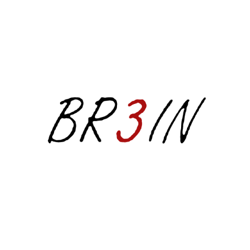

<h1 align="center">Hi 👋, I'm MHD Jafar Mortada</h1>
<h3 align="center">PhD student in biomedical engineering at Università Politecnica delle Marche in Ancona, Italy</h3>
<h3 align="center">I am a part of the BR3IN team 😎 at UNIVPM check our website for last update at https://br3in.dii.univpm.it/</h3>

  
  

  

- 🔭 I’m currently working on **Biomedical image processing particularly focusing on electromechanical imaging of the heart**

- 📫 How to reach me **m.j.mortada@pm.univpm.it**

- What can you find in my projects?  
-- **FetalBio-AI**: This work is a contribution presented at the GNB 2025 Conference, Palermo, Italy, from June 16th to 18th, titled “FetalBio-AI: A Novel AI-Based Software for Fetal Biometry Estimation.” The authors are A. Sbrollini, M. Gjika, M. J. Mortada, M. AlKalet, and L. Burattini.  
-- **Logger**: A simple, Python-based logger designed for medical applications.  
-- **ECGlytics - ECG Segmentation Tool**: A GUI application for ECG signal analysis, segmentation, and visualization. Built with Python and Tkinter, this tool provides an interface for loading, filtering, and manually segmenting ECG signals across multiple leads and formats.  
-- **Multi-Arduino Signal Transfer Hub**: This repository contains Arduino and Processing codes that enable multiple Arduino boards to collect, store, and transfer signals to a single laptop through USB for further processing and analysis.  
-- **hundred_Prisoners**: This is a simple Java application that simulates the well-known 100 prisoners' problem.
-- **QR generator**:  user-friendly web application for generating high-quality QR codes with optional custom logos.
-- **SegMed**: Coming soon 😉  

<h3 align="center">Connect with me:</h3>

  
  
  

<h3 align="center">Languages and Tools:</h3>

  
  
  
  
  
  
  
  
  
  
  

  

